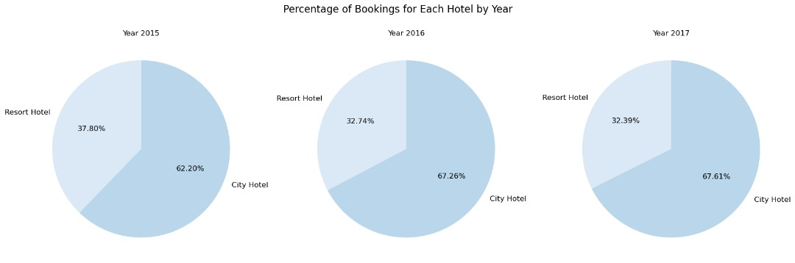
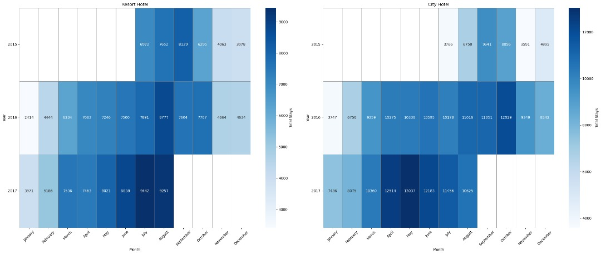
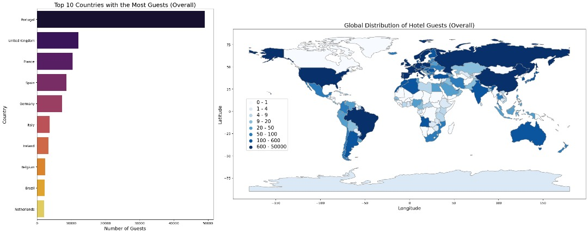
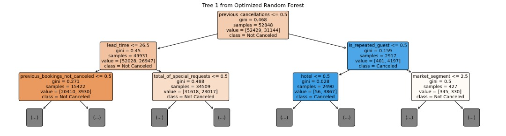

# Hotel Bookings Prediction

**One-liner:** End-to-end analysis and modelling of hotel booking data with a clean, reproducible Jupyter workflow and a published HTML report.

## What’s here
- `main.ipynb` — final, annotated notebook (EDA → feature engineering → modelling → evaluation).
- `main.html` — exported HTML of the notebook for quick viewing without a Python runtime.
- `hotel_bookings.csv` — source CSV used by the notebook.

## How to run
1. Launch Jupyter and open `main.ipynb`.
2. Ensure these libraries are installed: `pandas`, `numpy`, `seaborn`, `matplotlib`, `tabulate`, `calendar`,
   `geopandas`, `pycountry`, `IPython`, `scikit-learn`, `graphviz`.
3. Run all cells top-to-bottom. For a static view, open `main.html` in your browser.

## Project scope (high level)
- **Goal:** Explore hotel booking data and build a predictive workflow that explains patterns and outcomes.
- **Workflow:** Load data → EDA → feature engineering (date parts, categorical handling, etc.) → model training & evaluation → export figures.
- **Artifacts:** Notebook (source of truth), HTML report for easy sharing, and a formal PDF report.

## Results (visuals)

**Figure 1 — City vs Resort Booking Share by Year (2015–2017)**  

  

**Figure 2 — Monthly Booking Volume Heatmaps: Resort vs City**  

  

**Figure 3 — Top Guest Countries & Global Distribution**  

  

**Figure 4 — Interpretable Tree from Optimized Random Forest (Cancellation)**  

  

## Notes
- Add new charts to `Figures/` so GitHub previews them here.
- For large datasets, consider linking externally and ignoring them in git.

## Author
Lee Shan Yan